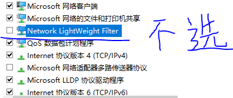
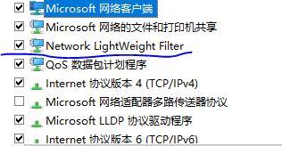

# 电脑经验
## 网络部分
1. 网络有问题时，分为两步解决：先拔掉小米随身wifi，然后在以太网属性中，去掉勾选`Network LightWeight Filter` ,再按图修改IP地址，即可上网，但不能使用小米随身wifi

    

2. 能够上网后，卸载小米随身wifi的客户端，再重新去官网下载，安装，此时，以太网属性自动中的`Network LightWeight Filter` 自动被勾选，能够正常使用小米随身wifi，台式机也能够上网

    

3. 步骤`1` 完成后，不能直接去勾选`Network LightWeight Filter` 来使用小米wifi，否则台式机又不能上网，必须按照`2` 步骤来做，才能保证台式机能够上网，小米wifi也能用