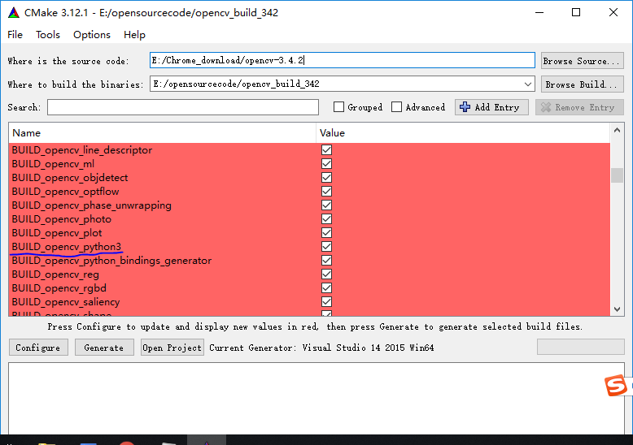
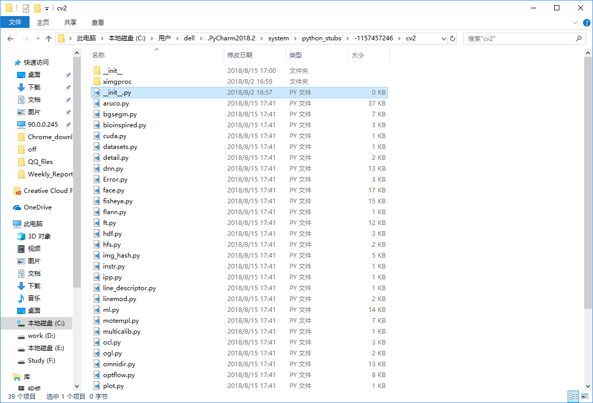

# 电脑经验
## Win下编译opencv python3
1. 先安装CMake，再装Anaconda 3，若已装了Anaconda，需卸了重装，这样CMake才能检测到python3的所有路径配置，才会自动跳出来`BUILD_opencv_python3`的选项，再根据需要勾选extra_modules(即opencv_contrib)和nonfree(如bm3d等一切在不勾选此选项时，提示nonfree导致不能用的算法)选项。注意在配置编译器的时候，**一定要选64位版本的Visual Studio，默认不是64位的，这样在打开的sln项目文件中，配置才是x64的，否则就是Win32应用程序**。在VS中，只用生成`bindings-python`这个部分，其它不用管

    

2. 把生成的`bin\Release`下的所有文件(包括dll和database)，以及`lib\python3\Release`下的`cv2.cp36-win_amd64.pyd`复制到`Anaconda3\DLLs`文件夹中，此时可以`import cv2`，可正常使用但在pycharm中没有函数提示

3. 进入下图目录，pycharm在进行函数提示时，调用此处的`__init__.py`文件，此时为0kb，打开上方的`__init__`文件夹，将里面非空的`__init__.py`拷贝到`cv2`目录下，删掉原来0kb的`__init__.py`,重启pycharm，提示回来了!

    

